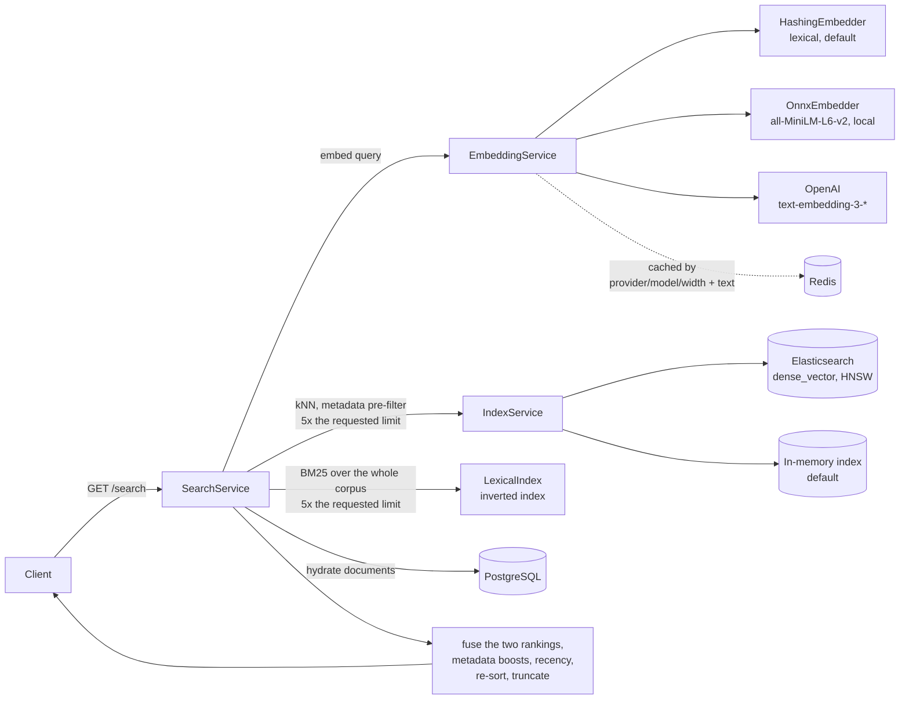

# Semantic Search Java

A hybrid document search service built with Java and Spring Boot. Every query is
retrieved twice, once by vector similarity and once by BM25 over an inverted
index, and the two rankings are combined and re-scored with metadata boosts and
recency. A built-in eval harness reports MRR, NDCG@k and Recall@k, so a ranking
change is a measurement instead of an opinion.

A React UI is compiled into the jar and served at `/`.


Above is the `demo` profile answering `keeping p95 response time low` — a query
that shares only the token `p95` with the document it retrieves. The score shown
is the blended one described below.

## Architecture



Writes go the other way, through `DocumentService`: hash, dedupe, persist, embed,
upsert into the index under the document id, then invalidate the search cache.

## Quick start

Requires JDK 21 or later. Nothing else — no database, no Docker.

```bash
./mvnw clean package
java -jar target/semantic-search-java-1.0.0.jar --spring.profiles.active=demo
```

The `demo` profile runs entirely in memory: H2 for storage, an in-process vector
index, the lexical embedder and no authentication. It seeds a small corpus at
startup so search returns something immediately. Add `EMBEDDING_PROVIDER=onnx`
for semantic matching; the first run downloads a 90 MB model.

| | |
| --- | --- |
| UI | <http://localhost:8080/> |
| API docs | <http://localhost:8080/swagger-ui.html> |
| Health | <http://localhost:8080/actuator/health> |
| Metrics | <http://localhost:8080/actuator/prometheus> |

```bash
curl "http://localhost:8080/api/v1/search?query=keeping+p95+response+time+low"
```

A real response from that command, with the score shortened:

```json
[
  {
    "id": "b5a8d543-00fd-4952-949a-959df667b332",
    "title": "Latency Budgets",
    "content": "Latency budgets keep search responses under a target p95. Every stage of the pipeline, from embedding the query to fetching documents, spends part of that budget.",
    "metadata": { "topic": "performance" },
    "score": 0.3484,
    "highlights": ["Latency budgets keep search responses under a target p95"]
  }
]
```

Ids are generated per run, and the score carries more decimal places than shown.
It also drifts downward as the document ages, because recency decay is on by
default with a seven-day half-life.

## How ranking works

Two retrievers run over the whole corpus, and their rankings are combined:

1. The query is embedded and the index returns nearest neighbours by cosine
   similarity, over-fetching 5× the requested number of results (capped at 200).
   Against Elasticsearch this is an approximate kNN search over the HNSW graph
   built for the `vector` field, with metadata filters applied inside it.
2. In parallel, `LexicalIndex` ranks the corpus by BM25 over an in-memory
   inverted index, over-fetching the same number.
3. The two candidate lists are unioned. A document only one retriever found still
   gets a score from the other: its vector is read from the index, and BM25 is
   computed for it directly.
4. The two signals are fused, metadata boosts are added, and the result is scaled
   by a recency multiplier.
5. Results scoring below `minScore` are dropped, the list is sorted by the final
   score, and truncated to `limit`.

Retrieving lexically is what makes the words a way in. A document whose terms
match the query exactly, but whose embedding sits outside the vector
neighbourhood, is found by step 2 and could not be recovered at any weight when
BM25 only re-scored what kNN had already returned.

### Fusion

`search.fusion` picks how step 4 combines the two.

- **`blend` (default).** A weighted sum, `search.hybrid-vector-weight` on the
  vector score and the remainder on BM25. Keeps score magnitudes, so a strong
  match stays visibly stronger and `minScore` keeps one meaning.
- **`rrf`.** Reciprocal rank fusion: each list contributes `1 / (k + rank)` with
  `search.rrf-k` defaulting to 60, normalised so the best possible score is 1.0.
  Reads positions only, so the two lists need not agree on what a score means.

They fail in opposite directions, which is why both are here. On the gold set the
blend wins:

| | MRR | NDCG@5 | Recall@5 |
| --- | --- | --- | --- |
| `onnx` + `blend` | **0.938** | **0.954** | 1.000 |
| `onnx` + `rrf` | 0.844 | 0.883 | 1.000 |
| `hashing` + `blend` | 0.615 | 0.679 | 0.875 |
| `hashing` + `rrf` | **0.635** | **0.695** | 0.875 |

On a query that is one rare identifier, RRF wins and the blend cannot. Give the
blend two dozen close vector matches and one document that holds the term and
nothing else, and the lexical-only document caps at the lexical weight, 0.3 at
the defaults, while every decoy keeps around 0.75. No BM25 score clears that gap.
RRF compares positions, so rank 1 on the lexical list stands beside rank 1 on the
vector list. `HybridRetrievalTest` pins both outcomes.

`minScore` is a floor on the score you get back. It is applied to the blended
score after boosts and decay, not to the raw vector score, which is always lower.

Its default of `0.2` is calibrated to the lexical default: over the gold set the
best match for a natural-language query scores between 0.32 and 0.53, every query
still returns something at a floor of 0.3, and none do at 0.4. Under `onnx` the
same eight queries score 0.36 to 0.64, so the default leaves more headroom there.
Any other model spreads scores differently, and a floor set for one is not a
floor for another.

### Recency

Age scales the final score by a multiplier that starts at 1.0 and falls towards
`search.recency-floor` (default `0.7`), closing half the remaining gap every
half-life (default seven days). The bound is what keeps freshness a tiebreaker.
An unbounded exponential is down to 0.05 after a month and 2e-16 after a year, so
every document in a corpus older than a few half-lives scores under any `minScore`
and the service answers every query with an empty list.

| Age | Bounded multiplier | Unbounded |
| --- | --- | --- |
| new | 1.00 | 1.00 |
| 1 week | 0.85 | 0.50 |
| 1 month | 0.72 | 0.05 |
| 1 year | 0.70 | 2e-16 |

Set `search.recency-floor: 0.0` for the unbounded curve, or
`search.recency-enabled: false` to rank without age.

### Embeddings

Three providers, selected by `EMBEDDING_PROVIDER`:

- **`hashing` (default).** A feature-hashing vectoriser over word tokens and
  character n-grams, with sublinear term-frequency weighting. No API key, no
  model download, deterministic. It is a *lexical* model: it scores shared words
  and word fragments, so "ranking" and "ranked" score 0.26 where two unrelated
  words score below zero, but it has no way to know that "car" and "automobile"
  are related.
- **`onnx`.** all-MiniLM-L6-v2 run in-process through ONNX Runtime, 384
  dimensions. Token vectors are mean-pooled over the attention mask and
  L2-normalised, which is how the model was trained to produce a sentence vector.
  It scores "car" against "automobile" at 0.86 and against "banana" at 0.39.
  Still no API key, and still deterministic, at the cost of a 90 MB model file
  and about 1.4 ms per uncached query.
- **`openai`.** Supply `EMBEDDING_API_KEY` and set `EMBEDDING_DIMENSIONS` to
  match the model (1536 for `text-embedding-3-small` at full width).

The ONNX weights are fetched from Hugging Face on first use, pinned to a commit
and checked against a SHA-256 in `application.yml`, then cached under
`~/.cache/semantic-search-java/models`. A file that does not match its digest is
rejected instead of loaded. Set `EMBEDDING_ONNX_AUTO_DOWNLOAD=false` to require
that the files are already there.

ONNX Runtime ships native libraries for every platform it supports in one jar,
which takes the built artifact from 96 MB to 173 MB whether or not the provider
is switched on.

```bash
EMBEDDING_PROVIDER=onnx java -jar target/semantic-search-java-1.0.0.jar \
  --spring.profiles.active=demo
```

Vectors from different models are not comparable. After switching providers or
changing the dimension, rebuild the index:

```bash
curl -X POST http://localhost:8080/api/v1/search/index/rebuild
```

## Evaluation

`GET /api/v1/eval/run` scores a curated gold set against the seeded corpus and
returns MRR, NDCG@k and Recall@k. CI publishes the same report as the
`eval-report` artifact.

The numbers below are verbatim runs of that endpoint on the `demo` profile over
the same eight documents, once per local provider. The committed copies are
[`docs/eval-report.json`](docs/eval-report.json) and
[`docs/eval-report-onnx.json`](docs/eval-report-onnx.json); regenerate either
with `curl -s localhost:8080/api/v1/eval/run?k=5 > docs/eval-report.json`.

| | MRR | NDCG@5 | Recall@5 | Gold document ranked first |
| --- | --- | --- | --- | --- |
| `hashing`, 256 dimensions | 0.615 | 0.679 | 0.875 | 4 of 8 |
| `onnx`, 384 dimensions | **0.938** | **0.954** | **1.000** | **7 of 8** |

Per query, as reciprocal rank:

| Gold query | `hashing` | `onnx` |
| --- | --- | --- |
| how does embedding similarity work | 0.25 | 1.00 |
| what affects result ordering | 0.00 | 0.50 |
| keeping p95 response time low | 1.00 | 1.00 |
| boosting newer documents | 0.33 | 1.00 |
| measuring search quality offline | 0.33 | 1.00 |
| term frequency scoring | 1.00 | 1.00 |
| splitting large files into passages | 1.00 | 1.00 |
| avoiding repeated work per query | 1.00 | 1.00 |

`what affects result ordering` is the query that separates the two. It shares no
word with *Ranking Signals* beyond stopwords, so the lexical embedder never
retrieves it at all; the transformer puts it second, which is the one row under
`onnx` that is not a first place. One relevant document per query cannot tell
that apart from a genuine miss.

The build fails if either provider regresses. Thresholds live in
`EvalServiceIntegrationTest` and `OnnxEvalTest`, set below the measured values so
ordinary tuning does not break them, and the ONNX thresholds sit above everything
the lexical embedder reaches, so a config change that quietly falls back to it
fails the build.

Eight queries with one relevant document each is a regression guard, not a
relevance benchmark. It is too small to support a claim about ranking quality in
general.

### Choosing a provider

|  | `hashing` (default) | `onnx` | `openai` |
| --- | --- | --- | --- |
| Setup | none | 90 MB model, fetched on first use | `EMBEDDING_API_KEY` |
| Matches on | shared words and character n-grams | learned meaning | learned meaning |
| `ranking` ≈ `ranked` | 0.26 | 0.82 | yes |
| `car` ≈ `automobile` | **-0.12** | 0.86 | yes |
| `car` ≈ `banana` | -0.21 | 0.39 | |
| Added latency per uncached query | none | 1.4 ms | a network round trip |
| Runs offline | yes | yes | no |
| Determinism | exact | exact | model-version dependent |
| MRR on the gold set | 0.615 | 0.938 | not measured here |

Cosine similarities are measured at each provider's own width, 256 for `hashing`
and 384 for `onnx`. Single words are the hardest case for feature hashing,
because two short strings give it very few features to collide on, which is why
`car` and `automobile` land slightly below zero instead of merely far apart.

The OpenAI column is left unmeasured. Nothing in this repository has run against
it, and an estimate would read like a measurement.

### Latency

Measured on the `demo` profile against the in-memory index, sequential requests
from `curl` on the same machine:

| | median | p95 |
| --- | --- | --- |
| `hashing`, warm cache, 30 requests over 6 repeated queries | 1.9 ms | 2.4 ms |
| `onnx`, warm cache, 30 requests over 6 repeated queries | 2.1 ms | 2.4 ms |
| `hashing`, 50 queries each seen once | 3.8 ms | 5.4 ms |
| `onnx`, 50 queries each seen once | 5.2 ms | 6.6 ms |

The warm rows barely move between providers because a cache hit returns before
anything is embedded. The gap between the two cold rows, about 1.4 ms, is what
running the transformer actually costs.

These describe an eight-document in-process index, so treat them as a floor for
pipeline overhead and not as a throughput result. `perf/k6-smoke.js` is a
10-user, 30-second smoke test over a single repeated query. It checks the service
stays up and under `p95 < 400ms`, and is not a load benchmark:

```bash
BASE_URL=http://localhost:8080 k6 run perf/k6-smoke.js
```

## API

Base path `/api/v1`. Full schema at `/swagger-ui.html`.

### Search

| Method | Path | Notes |
| --- | --- | --- |
| `GET` | `/search` | `query` (required), `limit` (10), `minScore` (0.2), `includeContent`, `includeHighlights` |
| `POST` | `/search/advanced` | Same fields as JSON, plus `filters` and `fields` |
| `GET` | `/search/similar/{id}` | Documents similar to an existing one |
| `POST` | `/search/index/rebuild` | Re-embed and re-index everything |

```bash
curl -X POST http://localhost:8080/api/v1/search/advanced \
  -H 'Content-Type: application/json' \
  -d '{"query":"vector search","limit":5,"minScore":0.1,"filters":{"topic":"search"}}'
```

A result is `{id, title, content, metadata, score, highlights}`. Scores are in
`[0,1]`. Unknown request fields are rejected rather than ignored.

### Documents

| Method | Path | Notes |
| --- | --- | --- |
| `POST` | `/documents` | `{title, content, metadata}` → `201`, or `409` on duplicate content |
| `GET` | `/documents/{id}` | |
| `PUT` | `/documents/{id}` | |
| `DELETE` | `/documents/{id}` | `204` |
| `GET` | `/documents` | Paged: `page`, `size`, `sort`, `direction` |
| `GET` | `/documents/search` | Keyword substring match on `text`, not semantic |
| `POST` | `/documents/seed` | Load the demo corpus |

`GET /documents` returns a Spring Data page (`{content, totalElements, ...}`),
not a bare array.

## Configuration

| Variable | Description | Default |
| --- | --- | --- |
| `EMBEDDING_PROVIDER` | `hashing`, `onnx` or `openai` | `hashing` |
| `EMBEDDING_DIMENSIONS` | Vector width for `hashing` and `openai`; also the index mapping. `onnx` reports its own. | `256` |
| `EMBEDDING_API_KEY` | Required by the `openai` provider | — |
| `EMBEDDING_MODEL` | Hosted model name | `text-embedding-3-small` |
| `EMBEDDING_ONNX_MODEL_DIR` | Where the ONNX model is cached | `~/.cache/semantic-search-java/models/all-MiniLM-L6-v2` |
| `EMBEDDING_ONNX_AUTO_DOWNLOAD` | Fetch the model when it is not cached | `true` |
| `ELASTICSEARCH_STUB_ENABLED` | Use the in-process vector index | `true` |
| `ELASTICSEARCH_HOST` / `_PORT` | Cluster to use when the stub is off | `localhost` / `9200` |
| `SECURITY_AUTH_ENABLED` | HTTP basic auth | `true` |
| `ADMIN_USER` / `ADMIN_PASSWORD` | Basic auth credentials | `admin` / `admin` |
| `SEED_DEMO_ENABLED` | Seed the demo corpus at startup | `false` |
| `EVAL_RUN_ON_STARTUP` | Run the eval harness at startup | `false` |
| `POSTGRES_HOST` / `_PORT` / `_DB` / `_USER` / `_PASSWORD` | Database | `localhost` / `5432` / `semanticsearch` / `postgres` / `postgres` |
| `REDIS_HOST` / `_PORT` | Embedding and result cache | `localhost` / `6379` |

Only `GET /search` and `/search/similar/**` are public when auth is on;
everything else requires credentials. The defaults are development credentials —
change them before exposing the service.

## Running the full stack

```bash
docker compose up --build
```

Starts the service against PostgreSQL, Elasticsearch and Redis, with the
in-process index switched off.

## Development

```bash
./mvnw clean verify        # spotless, tests, and the coverage gate
./mvnw spotless:apply      # fix formatting
```

The frontend lives in `ui/`:

```bash
cd ui && npm install && npm run dev    # proxies /api and /actuator to :8080
npm run build                          # writes to src/main/resources/static
```

The built bundle under `src/main/resources/static` is committed so that
`java -jar` serves the UI without a Node toolchain. CI fails if it is out of
date with the source, so rebuild and commit both together.

### Layout

```text
src/main/java/io/github/semanticsearch/
  controller/   REST endpoints
  service/      embedding, indexing, search, evaluation
  repository/   Spring Data access to PostgreSQL
  model/        Document and search DTOs
  config/       application configuration
  security/     authentication and CORS
ui/             React frontend source
perf/           k6 smoke test
docs/           eval reports and README images
```

Notable pieces: `HashingEmbedder` and `OnnxEmbedder` (the two in-process
embedding models, both behind `TextEmbedder`), `ModelCache` (fetches model
weights and checks them against a digest), `SearchService.search` (the
retrieve/re-rank pipeline), `DocumentService` (the write path, and the only place
that invalidates caches), `LexicalIndex` (the inverted index and BM25),
`EvalService` (the gold set and metrics).

### Known limitations

- The default embedder is lexical, so out of the box synonyms do not match.
  `EMBEDDING_PROVIDER=onnx` fixes that at the cost of a model download.
- The ONNX provider embeds a whole document as one vector. A long document with
  several unrelated sections averages into a vector that represents none of them,
  and the 256-token window drops everything past roughly the first two hundred
  words. Passage-level chunking is the fix.
- The inverted index is held in memory and rebuilt from the repository whenever
  the corpus changes size, so lexical retrieval costs a full rescan per write and
  the postings sit on the heap. For a large corpus, push lexical retrieval into
  Elasticsearch, which maintains an inverted index natively and can combine the
  two rankings itself.
- Metadata filters reach the vector retriever, which applies them inside the kNN
  search, but not the lexical one, where they are applied to its output. A
  heavily filtered query can therefore draw fewer lexical candidates than it
  asked for.
- PostgreSQL and the search index are written in one database transaction but
  share no transaction of their own. An index write that succeeds before a failed
  commit leaves a vector with no row; index writes are upserts keyed on the
  document id, so `reconcileUnindexed` and a rebuild both repair it. A durable
  outbox would close the window properly.
- Against a real Elasticsearch, a newly created document becomes searchable at the
  next index refresh (a second by default) rather than immediately.
- The evaluation set is eight queries with one relevant document each — a
  regression guard, not a relevance benchmark.
- Persistence entities double as API request and response bodies, so responses
  carry internal fields such as `vectorId`, `contentHash` and `indexed`.
- Schema is managed by Hibernate `ddl-auto`; Flyway is present but disabled.

## License

MIT
