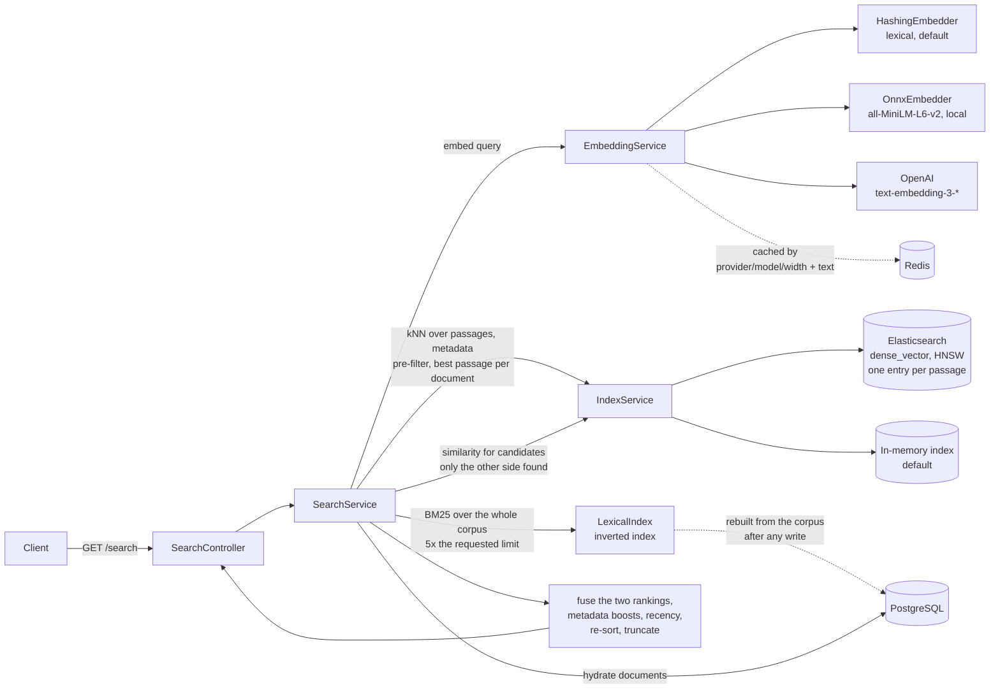
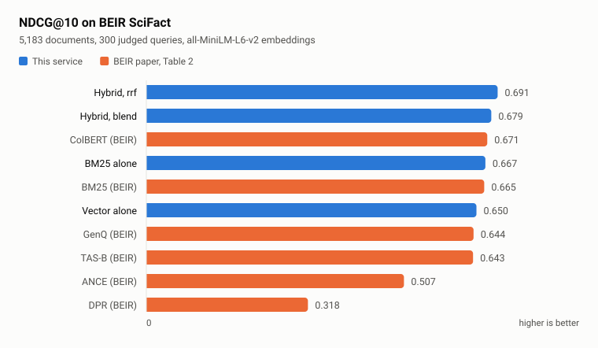

# Semantic Search Java

A hybrid document search service built with Java and Spring Boot. Every query is
retrieved twice, once by vector similarity and once by BM25 over an inverted
index, and the two rankings are combined and re-scored with metadata boosts and
recency. A built-in eval harness reports MRR, NDCG@k and Recall@k, so a ranking
change can be measured.

A React UI is compiled into the jar and served at `/`.


Above is the `demo` profile with `EMBEDDING_PROVIDER=onnx`, answering `keeping
p95 response time low`. The query shares one token with the document it ranks
first and none at all with the two below it, which are there on meaning. The
scores are the blended ones described below.

## Architecture



Writes go the other way, through `DocumentService`. It hashes, dedupes, persists,
embeds, upserts each passage into the vector index under its own id, then drops
the search cache and the lexical index. Rebuilding the postings on the next query
costs a pass over the corpus, which is the price of BM25 statistics that are
corpus-wide.

## Requirements

JDK 21 or later, and nothing else to start: no database, no Docker, no Node.
`./mvnw` and `mvnw.cmd` are both committed, and `.gitattributes` normalises line
endings, so a clone works the same on Linux, macOS and Windows.

The `onnx` provider is the one exception. It loads a native library, and the one
that ships supports four platforms:

| | `hashing`, `openai` | `onnx` |
| --- | --- | --- |
| Linux x86-64 | yes | yes |
| Linux arm64 | yes | yes |
| macOS Apple silicon | yes | yes |
| Windows x86-64 | yes | yes |
| macOS Intel | yes | **no** |

Microsoft stopped shipping a macOS x86-64 build of ONNX Runtime after 1.22, so
there is no binary to load. Selecting the provider there fails at startup with a
message naming the platform, and the tests that need it skip, the same way the
Elasticsearch tests skip when no Docker daemon is running. Everything else in
this repository is pure Java.

The published image is Debian-based for the same reason: both native libraries
are linked against glibc and neither has a musl build, so on Alpine the `onnx`
provider fails while the others keep working.

## Quick start

```bash
./mvnw clean package
java -jar target/semantic-search-java-1.0.0.jar --spring.profiles.active=demo
```

The `demo` profile runs entirely in memory: H2 for storage, an in-process vector
index, the lexical embedder and no authentication. It seeds a small corpus at
startup so search returns something immediately. Add `EMBEDDING_PROVIDER=onnx`
for semantic matching; the first run downloads a 90 MB model.

| | |
| --- | --- |
| UI | <http://localhost:8080/> |
| API docs | <http://localhost:8080/swagger-ui.html> |
| Health | <http://localhost:8080/actuator/health> |
| Metrics | <http://localhost:8080/actuator/prometheus> |


```bash
curl "http://localhost:8080/api/v1/search?query=keeping+p95+response+time+low"
```

A real response from that command, with scores shortened:

```json
[
  {
    "id": "7fc51eed-d087-4977-ad7a-7bea2dea49f9",
    "title": "Latency Budgets",
    "content": "Latency budgets keep search responses under a target p95. Every stage of the pipeline, from embedding the query to fetching documents, spends part of that budget.",
    "metadata": { "topic": "performance" },
    "score": 0.3484,
    "highlights": ["Latency budgets keep search responses under a target p95"]
  },
  {
    "id": "111d8ab5-2c25-4170-bdc1-898b0cb8a113",
    "title": "Evaluating Relevance",
    "content": "Offline evaluation compares ranked results against a gold set using metrics like MRR, NDCG and recall. Without a gold set, tuning relevance is guesswork.",
    "metadata": { "topic": "evaluation" },
    "score": 0.2239,
    "highlights": []
  }
]
```

Ids are generated per run, and the score carries more decimal places than shown.
It also drifts downward as the document ages, because recency decay is on by
default with a seven-day half-life.

## How ranking works

Two retrievers run over the whole corpus, and their rankings are combined:

1. The query is embedded and the index returns the nearest passages by cosine
   similarity, then collapses them to documents keeping each document's best
   passage. `SearchService` asks for 5× the requested number of results, capped
   at 200. Against Elasticsearch that is an approximate kNN search over the HNSW
   graph built for the `vector` field, with metadata filters applied inside it,
   and it fetches four passages per requested result, widening to sixteen if the
   first fetch comes back full and still collapses to too few documents. The
   in-process index scores every stored passage and needs no over-fetch.
2. `LexicalIndex` ranks the corpus by BM25 over an in-memory inverted index,
   over-fetching the same number. The two retrievals run one after the other on
   the request thread.
3. The two candidate lists are unioned. A document only one retriever found still
   gets a score from the other: its vector is read from the index, and BM25 is
   computed for it directly.
4. The two signals are fused, metadata boosts are added, and the result is scaled
   by a recency multiplier.
5. Results scoring below `minScore` are dropped, the list is sorted by the final
   score, and truncated to `limit`.

A document whose terms match the query exactly but whose embedding sits outside
the vector neighbourhood is found by step 2. Scoring only the kNN candidates
would leave it unreachable at any weight.

### Fusion

`search.fusion` picks how step 4 combines the two.

- **`blend` (default).** A weighted sum, `search.hybrid-vector-weight` on the
  vector score and the remainder on BM25, floored at the vector score so BM25 can
  raise a document and never lower one. Keeps score magnitudes, so a strong match
  stays visibly stronger and `minScore` keeps one meaning.
- **`rrf`.** Reciprocal rank fusion: each list contributes `1 / (k + rank)` with
  `search.rrf-k` defaulting to 60, normalised so the best possible score is 1.0.
  Reads positions only, so the two lists need not agree on what a score means.

They fail in opposite directions, which is why both are here. On the gold set the
blend wins:

| | MRR | NDCG@5 | Recall@5 |
| --- | --- | --- | --- |
| `onnx` + `blend` | **0.938** | **0.954** | 1.000 |
| `onnx` + `rrf` | 0.844 | 0.883 | 1.000 |
| `hashing` + `blend` | 0.615 | 0.679 | 0.875 |
| `hashing` + `rrf` | **0.635** | **0.695** | 0.875 |

On a query that is one rare identifier, RRF wins and the blend cannot. Give the
blend forty close vector matches and one document that holds the term and nothing
else, and the lexical-only document caps near the lexical weight, 0.3 at the
defaults, while every decoy keeps around 0.75. No BM25 score clears that gap. RRF
compares positions, so rank 1 on the lexical list stands beside rank 1 on the
vector list. `HybridRetrievalTest` pins both outcomes.

`minScore` is a floor on the score you get back. It is applied to the blended
score after boosts and decay, not to the raw vector score, which is always lower.

Its default of `0.2` is calibrated to the lexical default. Over the eight gold
queries the best match scores between 0.32 and 0.53; raising the floor to 0.3
still answers all eight, and 0.4 answers only three. The default sits below that
edge while cutting the weak tail, taking those queries from 64 results to 22.
Under `onnx` the same queries score 0.37 to 0.64, so the default leaves more
headroom there. Any other model spreads scores differently, so this default needs
recalibrating when the provider changes.

### Recency

Age scales the final score by a multiplier that starts at 1.0 and falls towards
`search.recency-floor` (default `0.7`), closing half the remaining gap every
half-life (default seven days). The bound is what keeps freshness a tiebreaker.
An unbounded exponential is down to 0.05 after a month and 2e-16 after a year, so
every document in a corpus older than a few half-lives scores under any `minScore`
and the service answers every query with an empty list.

| Age | Bounded multiplier | Unbounded |
| --- | --- | --- |
| new | 1.00 | 1.00 |
| 1 week | 0.85 | 0.50 |
| 1 month | 0.72 | 0.05 |
| 1 year | 0.70 | 2e-16 |

Set `search.recency-floor: 0.0` for the unbounded curve, or
`search.recency-enabled: false` to rank without age.

### Passages

A document is split into overlapping windows of `embedding.chunk.max-words`
(default 170) with `embedding.chunk.overlap-words` (default 40) repeated between
them, and each window is embedded and indexed on its own. Retrieval scores
passages and keeps each document's best one.

The window is set against the ONNX provider's 256 word pieces, roughly 190
English words. One vector for a longer document is a vector for its opening:
everything past the window is text the model never read, so a document can hold
the exact answer and still be unreachable by meaning. Averaging hurts inside the
window too, because a document covering three subjects lands between all three
and close to none.

Overlap exists so a boundary cannot fall through the middle of the one sentence
that answers a query and leave both halves too weak to retrieve. The title is
repeated at the head of every passage, since a window from the middle of a long
document otherwise arrives with nothing saying what it belongs to; it counts
against the window and is cut to a quarter of it, so a long title cannot push
each passage past the size it was chosen to fit.

A document shorter than the window is one passage holding exactly the text it
would have been indexed with anyway, so a corpus of short documents is unchanged.
`Document.passageCount` records the split, which is what lets an edit that
shortens a document delete precisely the passages it no longer has.

Every passage is embedded before any of them is written. A provider that fails
halfway would otherwise leave the index holding the opening of the new text
beside the tail of the old, under one document id, with the recorded count
describing neither. A failed write leaves the index exactly as it was and the
row marked unindexed, which is the state `reconcileUnindexed` repairs.

### Embeddings

Three providers, selected by `EMBEDDING_PROVIDER`:

- **`hashing` (default).** A feature-hashing vectoriser over word tokens and
  character n-grams, with sublinear term-frequency weighting. No API key, no
  model download, deterministic. It is a *lexical* model: it scores shared words
  and word fragments, so "ranking" and "ranked" score 0.26 where two unrelated
  words score below zero, but it has no way to know that "car" and "automobile"
  are related.
- **`onnx`.** all-MiniLM-L6-v2 run in-process through ONNX Runtime, 384
  dimensions. Token vectors are mean-pooled over the attention mask and
  L2-normalised, which is how the model was trained to produce a sentence vector.
  It scores "car" against "automobile" at 0.86 and against "banana" at 0.39.
  Still no API key, and still deterministic, at the cost of a 90 MB model file
  and about 2 ms per uncached query.
- **`openai`.** Supply `EMBEDDING_API_KEY` and set `EMBEDDING_DIMENSIONS` to
  match the model (1536 for `text-embedding-3-small` at full width).

The ONNX weights are fetched from Hugging Face on first use, pinned to a commit
and checked against a SHA-256 in `application.yml`, then cached under
`~/.cache/semantic-search-java/models`. A file that does not match its digest is
rejected instead of loaded. Set `EMBEDDING_ONNX_AUTO_DOWNLOAD=false` to require
that the files are already there.

ONNX Runtime ships native libraries for every platform it supports in one jar,
which takes the built artifact from 96 MB to 173 MB whether or not the provider
is switched on.

```bash
EMBEDDING_PROVIDER=onnx java -jar target/semantic-search-java-1.0.0.jar \
  --spring.profiles.active=demo
```

Vectors from different models are not comparable. After switching providers or
changing the dimension, rebuild the index:

```bash
curl -X POST http://localhost:8080/api/v1/search/index/rebuild
```

## Evaluation

`GET /api/v1/eval/run?k=5` scores a curated gold set against the seeded corpus
and returns MRR, NDCG@k and Recall@k. CI uploads the same JSON as the
`eval-report` artifact, measured under the test profile, which runs the lexical
embedder at 128 dimensions and so reports slightly different values from the
demo profile below.

The numbers below are verbatim runs of that endpoint on the `demo` profile over
the same eight documents, once per local provider. The committed copies are
[`docs/eval-report.json`](docs/eval-report.json) and
[`docs/eval-report-onnx.json`](docs/eval-report-onnx.json); regenerate either
with `curl -s localhost:8080/api/v1/eval/run?k=5 > docs/eval-report.json`.

| | MRR | NDCG@5 | Recall@5 | Gold document ranked first |
| --- | --- | --- | --- | --- |
| `hashing`, 256 dimensions | 0.615 | 0.679 | 0.875 | 4 of 8 |
| `onnx`, 384 dimensions | **0.938** | **0.954** | **1.000** | **7 of 8** |

Per query, as reciprocal rank:

| Gold query | `hashing` | `onnx` |
| --- | --- | --- |
| how does embedding similarity work | 0.25 | 1.00 |
| what affects result ordering | 0.00 | 0.50 |
| keeping p95 response time low | 1.00 | 1.00 |
| boosting newer documents | 0.33 | 1.00 |
| measuring search quality offline | 0.33 | 1.00 |
| term frequency scoring | 1.00 | 1.00 |
| splitting large files into passages | 1.00 | 1.00 |
| avoiding repeated work per query | 1.00 | 1.00 |

`what affects result ordering` is the query that separates the two. It shares no
word with *Ranking Signals* beyond stopwords, so the lexical embedder never
retrieves it at all; the transformer puts it second, which is the one row under
`onnx` that is not a first place. One relevant document per query cannot tell
that apart from a genuine miss.

The build fails if either provider regresses. Thresholds live in
`EvalServiceIntegrationTest` and `OnnxEvalTest`, set below the measured values so
ordinary tuning does not break them, and the ONNX thresholds sit above everything
the lexical embedder reaches, so a config change that quietly falls back to it
fails the build.

Eight queries with one relevant document each is a regression guard, not a
relevance benchmark. It is too small to support a claim about ranking quality in
general.

### SciFact

`BeirBenchmark` indexes [BEIR](https://github.com/beir-cellar/beir)/SciFact,
5,183 abstracts and 300 judged queries, scores retrieval four ways and writes
[`docs/benchmark-scifact.json`](docs/benchmark-scifact.json):

```bash
EMBEDDING_PROVIDER=onnx java -jar target/semantic-search-java-1.0.0.jar \
  --spring.profiles.active=benchmark
```

CI runs the same thing from the `BEIR SciFact` job, which is `workflow_dispatch`
only, and uploads the report as an artifact.

It fetches a 2.7 MB archive on first use, checked against a digest, and takes
about a minute and a half end to end: 55 s to embed and index the corpus, the
rest to answer 1,200 queries.

| | NDCG@10 | Recall@100 | MRR | median | p95 |
| --- | --- | --- | --- | --- | --- |
| BM25 alone | 0.667 | 0.886 | 0.640 | 0.5 ms | 1.1 ms |
| Vector alone | 0.650 | 0.937 | 0.616 | 12.1 ms | 14.0 ms |
| Hybrid, `blend` | 0.679 | 0.962 | 0.645 | 13.6 ms | 15.3 ms |
| Hybrid, `rrf` | **0.691** | **0.965** | **0.655** | 13.3 ms | 15.2 ms |

Table 2 of the [BEIR paper](https://arxiv.org/abs/2104.08663) reports NDCG@10 on
this same split for six systems, so those rows can go beside these ones:

<picture>
  <source media="(prefers-color-scheme: dark)" srcset="docs/images/scifact-dark.svg">
  
</picture>

The BM25 row lands at 0.667 against their 0.665, which is the useful part of
running a published benchmark: the lexical retriever here is reproducing a number
computed by a different implementation, so the numbers beside it can be read as
measurements.

Rank fusion is the configuration that beats every model in that table. It is also
the configuration the eight-query gold set ranks below the blend.

#### What passages were worth here

The same code with `EMBEDDING_CHUNK_MAX_WORDS=100000`, so nothing splits and each
document is one vector:

| | NDCG@10 | Recall@100 | median |
| --- | --- | --- | --- |
| BM25 alone | 0.667 | 0.886 | 0.5 ms |
| Vector alone | 0.645 | 0.925 | 8.7 ms |
| Hybrid, `blend` | 0.673 | 0.958 | 10.0 ms |
| Hybrid, `rrf` | 0.685 | 0.968 | 10.2 ms |

Passages are worth about half a point of NDCG@10 on every row that uses vectors,
and a point of Recall@100 on the vector row. Rank fusion loses 0.3 points of
recall and gains 0.6 of NDCG@10. They cost a third of the query latency and 18 s
of indexing, and leave BM25 exactly where it was, since it reads whole documents
either way.

That is a smaller gain than the mechanism suggests, and the corpus explains it.
SciFact's median abstract is 204 words against a 170-word window, so most
documents split into two passages that overlap by 40 and largely repeat each
other. Passages pay when a document runs well past the window; here almost
nothing does. `ChunkedRetrievalTest` covers the case where they decide the
outcome, a sentence four hundred words in that one vector for the document cannot
reach at all.

#### Caveats

The BM25 is this repository's, not Anserini's, and the tokenizer and stop-word
list differ. The dense row is all-MiniLM-L6-v2, which is not in that table. Each
row is a single run on a laptop, with no significance testing.

The vector timings are exact search, not approximate. The benchmark runs on the
in-process index, which scores the query against every stored passage, so those
milliseconds grow linearly with the corpus and say nothing about how HNSW
behaves. Elasticsearch is where the approximate path lives, and measuring its
recall against exact search across `ef_search` and `m` is the missing
measurement here.

### Choosing a provider

|  | `hashing` (default) | `onnx` | `openai` |
| --- | --- | --- | --- |
| Setup | none | 90 MB model, fetched on first use | `EMBEDDING_API_KEY` |
| Matches on | shared words and character n-grams | learned meaning | learned meaning |
| `ranking` ≈ `ranked` | 0.26 | 0.82 | yes |
| `car` ≈ `automobile` | **-0.12** | 0.86 | yes |
| `car` ≈ `banana` | -0.21 | 0.39 | |
| Added latency per uncached query | none | 2 ms | a network round trip |
| Runs offline | yes | yes | no |
| Determinism | exact | exact | model-version dependent |
| MRR on the gold set | 0.615 | 0.938 | not measured here |

Cosine similarities are measured at each provider's own width, 256 for `hashing`
and 384 for `onnx`. Single words are the hardest case for feature hashing,
because two short strings give it very few features to collide on, which is why
`car` and `automobile` land slightly below zero instead of merely far apart.

The OpenAI column is left unmeasured. Nothing in this repository has run against
it, and an estimate would read like a measurement.

### Latency

Measured on the `demo` profile against the in-memory index, sequential requests
from `curl` on the same machine:

| | median | p95 |
| --- | --- | --- |
| `hashing`, warm cache, 30 requests over 6 repeated queries | 2.1 ms | 2.5 ms |
| `onnx`, warm cache, 30 requests over 6 repeated queries | 2.0 ms | 2.5 ms |
| `hashing`, 50 queries each seen once | 3.4 ms | 4.5 ms |
| `onnx`, 50 queries each seen once | 5.4 ms | 6.3 ms |

The warm rows are the same for both providers, because a cache hit returns before
anything is embedded. The gap between the two cold rows, about 2 ms, is what
running the transformer costs.

These describe an eight-document in-process index, so treat them as a floor for
pipeline overhead and not as a throughput result. The per-configuration timings
in the SciFact table above are the ones measured over 5,183 documents. `perf/k6-smoke.js` is a
10-user, 30-second smoke test over a single repeated query. It checks the service
stays up and under `p95 < 400ms`, and is not a load benchmark:

```bash
BASE_URL=http://localhost:8080 k6 run perf/k6-smoke.js
```

### Instrumentation

`/actuator/prometheus` carries a timer per pipeline stage, so a slow query points
at the stage that was slow:

```text
search_stage_seconds{stage="embed"}
search_stage_seconds{stage="vector_retrieval"}
search_stage_seconds{stage="lexical_retrieval"}
search_stage_seconds{stage="hydrate"}
search_results
```

Both are histograms with percentiles, tagged with the application name and the
active profile. `search_results` records how many results each query returned,
which is where a `minScore` set too high shows up first.

## API

Base path `/api/v1`. Full schema at `/swagger-ui.html`.

### Search

| Method | Path | Notes |
| --- | --- | --- |
| `GET` | `/search` | `query` (required), `limit` (10), `minScore` (0.2), `includeContent`, `includeHighlights` |
| `POST` | `/search/advanced` | Same fields as JSON, plus `filters` and `fields` |
| `GET` | `/search/similar/{id}` | Documents similar to an existing one |
| `POST` | `/search/index/rebuild` | Re-embed and re-index everything |
| `GET` | `/eval/run` | Score the gold set. `k` (5) sets the NDCG and Recall cutoff |

```bash
curl -X POST http://localhost:8080/api/v1/search/advanced \
  -H 'Content-Type: application/json' \
  -d '{"query":"vector search","limit":5,"minScore":0.1,"filters":{"topic":"search"}}'
```

A result is `{id, title, content, metadata, score, highlights}`. Scores are in
`[0,1]`. Unknown request fields are rejected rather than ignored.

### Documents

| Method | Path | Notes |
| --- | --- | --- |
| `POST` | `/documents` | `{title, content, metadata}` → `201`, or `409` on duplicate content |
| `GET` | `/documents/{id}` | |
| `PUT` | `/documents/{id}` | |
| `DELETE` | `/documents/{id}` | `204` |
| `GET` | `/documents` | Paged: `page`, `size`, `sort`, `direction` |
| `GET` | `/documents/search` | Keyword substring match on `text`, not semantic |
| `POST` | `/documents/seed` | Load the demo corpus |

`GET /documents` returns a Spring Data page (`{content, totalElements, ...}`),
not a bare array.

## Configuration

| Variable | Description | Default |
| --- | --- | --- |
| `EMBEDDING_PROVIDER` | `hashing`, `onnx` or `openai` | `hashing` |
| `EMBEDDING_DIMENSIONS` | Vector width for `hashing` and `openai`; also the index mapping. `onnx` reports its own. | `256` |
| `EMBEDDING_API_KEY` | Required by the `openai` provider | none |
| `EMBEDDING_MODEL` | Hosted model name | `text-embedding-3-small` |
| `EMBEDDING_CHUNK_MAX_WORDS` | Words per passage, counting the repeated title | `170` |
| `EMBEDDING_CHUNK_OVERLAP_WORDS` | Words each passage repeats from the one before | `40` |
| `EMBEDDING_ONNX_MODEL_DIR` | Where the ONNX model is cached | `~/.cache/semantic-search-java/models/all-MiniLM-L6-v2` |
| `EMBEDDING_ONNX_AUTO_DOWNLOAD` | Fetch the model when it is not cached | `true` |
| `EMBEDDING_API_BASE_URL` | Hosted provider endpoint | `https://api.openai.com` |
| `SEARCH_FUSION` | `blend` or `rrf` | `blend` |
| `SEARCH_RRF_K` | The `k` in `1 / (k + rank)` | `60` |
| `SEARCH_RECENCY_ENABLED` | Scale scores by document age | `true` |
| `SEARCH_RECENCY_HALF_LIFE_SECONDS` | Half-life of the decay | `604800` |
| `SEARCH_RECENCY_FLOOR` | Smallest multiplier age can apply | `0.7` |
| `SEARCH_HYBRID_ENABLED` | Retrieve lexically as well as by vector | `true` |
| `SEARCH_HYBRID_VECTOR_WEIGHT` | Vector share of the blended score | `0.7` |
| `SEARCH_BM25_K1` / `_B` | BM25 term saturation and length normalisation | `1.2` / `0.75` |
| `ELASTICSEARCH_STUB_ENABLED` | Use the in-process vector index | `true` |
| `ELASTICSEARCH_HOST` / `_PORT` / `_PROTOCOL` | Cluster to use when the stub is off | `localhost` / `9200` / `http` |
| `ELASTICSEARCH_USERNAME` / `_PASSWORD` | Cluster credentials, unset means none | none |
| `MANAGEMENT_HEALTH_ELASTICSEARCH_ENABLED` | Include the cluster in `/actuator/health` | `false` |
| `SECURITY_AUTH_ENABLED` | HTTP basic auth | `true` |
| `ADMIN_USER` / `ADMIN_PASSWORD` | Basic auth credentials | `admin` / `admin` |
| `SEED_DEMO_ENABLED` | Seed the demo corpus at startup | `false` |
| `EVAL_RUN_ON_STARTUP` | Run the eval harness at startup | `false` |
| `BENCHMARK_AUTO_DOWNLOAD` | Fetch the BEIR archive when it is not cached | `true` |
| `POSTGRES_HOST` / `_PORT` / `_DB` / `_USER` / `_PASSWORD` | Database | `localhost` / `5432` / `semanticsearch` / `postgres` / `postgres` |
| `REDIS_HOST` / `_PORT` / `_PASSWORD` | Embedding and result cache | `localhost` / `6379` / none |
| `SPRING_CACHE_TYPE` | `redis`, or `simple` for an in-process cache | `redis` |

`search.*` and `embedding.onnx.*` are `@ConfigurationProperties`, so anything
under those prefixes also binds from an upper-case environment variable, and
`application.yml` lists a few more keys than are worth a row here.

With auth on, these answer without credentials: `GET /api/v1/search`,
`/api/v1/search/similar/**`, `/swagger-ui.html`, `/swagger-ui/**`,
`/v3/api-docs/**`, `/actuator/health` and `/actuator/info`. Everything else needs
them, including the bundled UI at `/`, the rest of `/actuator` and every write.
`SecurityRulesTest` pins that list. The defaults are development credentials.
Change them before exposing the service.

## Running the full stack

```bash
docker compose up --build
```

Starts the service against PostgreSQL, Elasticsearch and Redis, with the
in-process index switched off.

The image bakes in the settings that stack needs, and an environment variable
outranks profile YAML, so `--spring.profiles.active=demo` alone is not enough to
run the container on its own. Say so explicitly:

```bash
docker run -p 8080:8080 \
  -e SPRING_PROFILES_ACTIVE=demo \
  -e ELASTICSEARCH_STUB_ENABLED=true \
  ghcr.io/qharshil/semantic-search-java:latest
```

## Development

```bash
./mvnw clean verify        # spotless, tests, and the coverage gate
./mvnw spotless:apply      # fix formatting
```

`verify` runs the ONNX tests, so the first run on a clean machine downloads the
90 MB model. The Elasticsearch tests need a Docker daemon and skip without one,
which is the only part of the suite CI covers and a laptop might not.

The frontend lives in `ui/`:

```bash
cd ui && npm install && npm run dev    # proxies /api and /actuator to :8080
npm run build                          # writes to src/main/resources/static
```

The built bundle under `src/main/resources/static` is committed so that
`java -jar` serves the UI without a Node toolchain. CI fails if it is out of
date with the source, so rebuild and commit both together.

### Layout

```text
src/main/java/io/github/semanticsearch/
  controller/   REST endpoints
  service/      embedding, indexing, search, evaluation, metrics
  benchmark/    the BEIR runner and its dataset loader
  repository/   Spring Data access to PostgreSQL
  model/        Document and search DTOs
  util/         ScoreCalculator
  config/       application configuration
  exception/    the API error contract
  security/     authentication and CORS
src/main/resources/static/   the compiled UI, committed
ui/             React frontend source
perf/           k6 smoke test
docs/           eval reports, the benchmark report and README images
```

Notable pieces:

| | |
| --- | --- |
| `TextEmbedder` | the interface behind `HashingEmbedder` and `OnnxEmbedder` |
| `Chunker` | splits a document into overlapping passages |
| `VerifiedFileCache` | fetches large files and checks them against a digest |
| `SearchService.search` | retrieve twice, fuse, re-score, truncate |
| `LexicalIndex` | the inverted index, BM25 retrieval and BM25 scoring |
| `ScoreCalculator` | blending, rank fusion, metadata boosts, recency |
| `DocumentService` | the write path; it and `IndexService` are what drop the lexical index |
| `RankingMetrics` | MRR, NDCG@k and Recall@k, shared by both eval paths |
| `EvalService` | the curated gold set |
| `BeirBenchmark` | the SciFact run |
| `SearchMetrics` | the per-stage timers |

### Known limitations

- The default embedder is lexical, so synonyms do not match under the default
  configuration.
  `EMBEDDING_PROVIDER=onnx` fixes that at the cost of a model download.
- The in-process vector index, which is the default, scores every stored passage
  per query. Query cost grows linearly with the corpus. Elasticsearch is the
  approximate path, and nothing here measures its recall against exact search.
- That index lives in the heap, so a restart empties it while the rows survive.
  Startup re-embeds the stored corpus when it finds the index empty, which costs
  one embedding per passage at boot and is why the default configuration is worth
  using only up to the corpus size you are willing to wait for.
- The inverted index is held in memory and rebuilt from the repository after
  every write, so lexical retrieval costs a full rescan per write and the
  postings sit on the heap. For a large corpus, push lexical retrieval into
  Elasticsearch, which maintains an inverted index natively and can combine the
  two rankings itself.
- Only the Elasticsearch retriever pre-filters. The in-process index and the
  lexical index both ignore metadata filters and have them applied to their
  output, so a heavily filtered query draws fewer candidates than it asked for
  and can return less than `limit`.
- `minScore` is calibrated against blended scores. Under `rrf` a document found
  by one retriever alone caps at 0.5 whatever its similarity, so the same floor
  filters differently.
- PostgreSQL and the search index are written in one database transaction but
  share no transaction of their own. An index write that succeeds before a failed
  commit leaves a vector with no row; index writes are upserts keyed on the
  passage id, so `reconcileUnindexed` and a rebuild both repair it. A durable
  outbox would close the window properly.
- Against a real Elasticsearch, a newly created document becomes searchable at the
  next index refresh (a second by default) rather than immediately.
- The curated set is eight queries with one relevant document each. It guards
  against regressions; the SciFact run is what measures ranking quality.
- Passages are fixed-width word windows. They ignore sentence and paragraph
  boundaries, so a window can open mid-sentence; the overlap is what stops that
  losing the sentence entirely.
- `GET /search/similar/{id}` embeds the whole source document as its query
  instead of its passages, so under a provider with a context window a long
  document is compared on its opening alone.
- Persistence entities double as API request and response bodies, so responses
  carry internal fields such as `vectorId`, `contentHash`, `indexed` and
  `passageCount`.
- Schema is managed by Hibernate `ddl-auto`; Flyway is present but disabled.

## License

MIT
