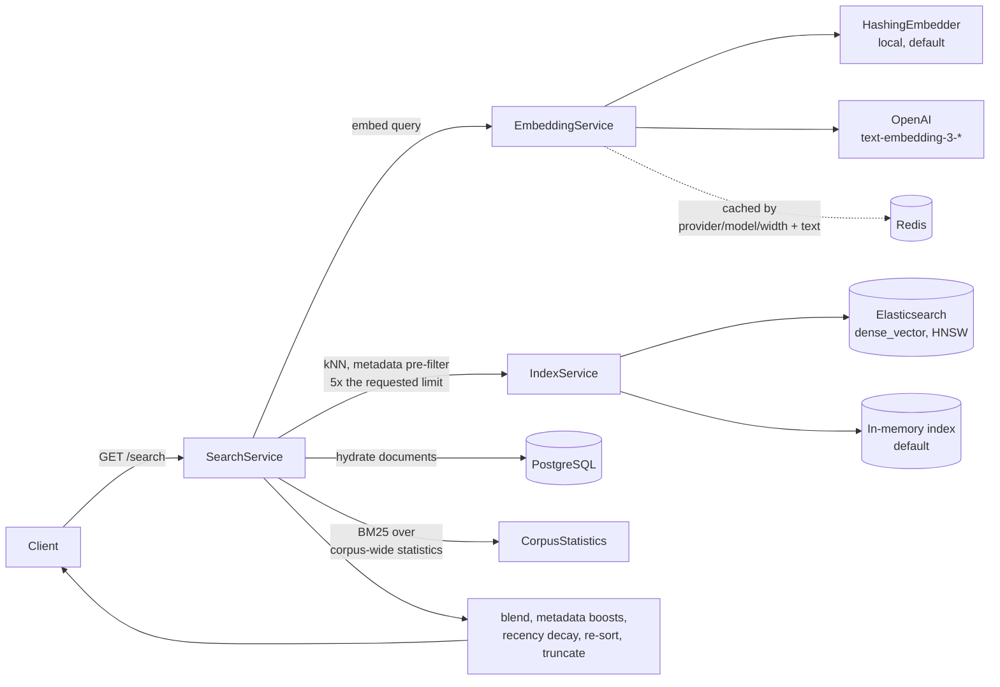

# Semantic Search Java

A hybrid document search service built with Java and Spring Boot. Documents are
retrieved by vector similarity, then re-ranked with BM25 lexical scoring,
metadata boosts and recency decay. A built-in eval harness reports MRR, NDCG@k
and Recall@k so ranking changes can be compared rather than guessed at.

A React UI is compiled into the jar and served at `/`.


Above is the `demo` profile answering `keeping p95 response time low` — a query
that shares only the token `p95` with the document it retrieves. The score shown
is the blended one described below.

## Architecture



Writes go the other way, through `DocumentService`: hash, dedupe, persist, embed,
upsert into the index under the document id, then invalidate the search cache.

## Quick start

Requires JDK 21 or later. Nothing else — no database, no Docker.

```bash
./mvnw clean package
java -jar target/semantic-search-java-1.0.0.jar --spring.profiles.active=demo
```

The `demo` profile runs entirely in memory: H2 for storage, an in-process vector
index, local embeddings and no authentication. It seeds a small corpus at
startup so search returns something immediately.

| | |
| --- | --- |
| UI | <http://localhost:8080/> |
| API docs | <http://localhost:8080/swagger-ui.html> |
| Health | <http://localhost:8080/actuator/health> |
| Metrics | <http://localhost:8080/actuator/prometheus> |

```bash
curl "http://localhost:8080/api/v1/search?query=keeping+p95+response+time+low"
```

A real response from that command, with the score shortened:

```json
[
  {
    "id": "b5a8d543-00fd-4952-949a-959df667b332",
    "title": "Latency Budgets",
    "content": "Latency budgets keep search responses under a target p95. Every stage of the pipeline, from embedding the query to fetching documents, spends part of that budget.",
    "metadata": { "topic": "performance" },
    "score": 0.3483,
    "highlights": ["Latency budgets keep search responses under a target p95"]
  }
]
```

Ids are generated per run, and the score carries more decimal places than shown.
It also drifts downward as the document ages, because recency decay is on by
default with a seven-day half-life.

## How ranking works

Retrieval is vector-first, then re-ranked:

1. The query is embedded and the index returns nearest neighbours by cosine
   similarity, over-fetching 5× the requested number of results (capped at 200).
   Against Elasticsearch this is an approximate kNN search over the HNSW graph
   built for the `vector` field, with metadata filters applied inside it.
2. Candidates are re-scored. The vector score is blended with a BM25 lexical
   score computed from corpus-wide term statistics, metadata boosts are added,
   and the result is scaled by a recency multiplier.
3. Results scoring below `minScore` are dropped, the list is sorted by the final
   score, and truncated to `limit`.

Because retrieval is vector-first, lexical scoring refines the ordering of
candidates rather than widening recall. The over-fetch is what gives it room to
change the outcome.

`minScore` is a floor on the score you get back, applied to the blended score
after boosts and decay — not to the raw vector score, which is always lower. Its
default of `0.2` is calibrated to the local embedder: over the gold set, the best
match for a natural-language query scores between 0.32 and 0.53, every query still
returns something at a floor of 0.3, and none do at 0.4. A hosted model spreads
scores differently and may want a higher floor.

### Recency

Age scales the final score by a multiplier that starts at 1.0 and falls towards
`search.recency-floor` (default `0.7`), closing half the remaining gap every
half-life (default seven days). The bound is what keeps freshness a tiebreaker.
An unbounded exponential is down to 0.05 after a month and 2e-16 after a year, so
every document in a corpus older than a few half-lives scores under any `minScore`
and the service answers every query with an empty list.

| Age | Bounded multiplier | Unbounded |
| --- | --- | --- |
| new | 1.00 | 1.00 |
| 1 week | 0.85 | 0.50 |
| 1 month | 0.72 | 0.05 |
| 1 year | 0.70 | 2e-16 |

Set `search.recency-floor: 0.0` for the unbounded curve, or
`search.recency-enabled: false` to rank without age.

### Embeddings

Two providers, selected by `EMBEDDING_LOCAL_ENABLED`:

- **Local (default).** A feature-hashing vectoriser over word tokens and
  character n-grams, with sublinear term-frequency weighting. It needs no API
  key and no model download, and it is deterministic. It is a *lexical* model:
  it scores shared words and word fragments, so "ranking" and "ranked" are
  close, but it does not know that "car" and "automobile" are related.
- **OpenAI.** Set `EMBEDDING_LOCAL_ENABLED=false`, supply `EMBEDDING_API_KEY`
  and set `EMBEDDING_DIMENSIONS` to match the model (1536 for
  `text-embedding-3-small` at full width).

Vectors from different models are not comparable. After switching providers or
changing the dimension, rebuild the index:

```bash
curl -X POST http://localhost:8080/api/v1/search/index/rebuild
```

## Evaluation

`GET /api/v1/eval/run` scores a curated gold set against the seeded corpus and
returns MRR, NDCG@k and Recall@k. CI publishes the same report as the
`eval-report` artifact.

The numbers below are a verbatim run of that endpoint on the `demo` profile —
local embedder, 256 dimensions, eight documents. The committed copy is
[`docs/eval-report.json`](docs/eval-report.json); regenerate it with
`curl -s localhost:8080/api/v1/eval/run?k=5 > docs/eval-report.json`.

**MRR 0.615 · NDCG@5 0.679 · Recall@5 0.875 · 8 queries**

| Gold query | RR | NDCG@5 | Recall@5 |
| --- | --- | --- | --- |
| how does embedding similarity work | 0.25 | 0.43 | 1.00 |
| what affects result ordering | 0.00 | 0.00 | 0.00 |
| keeping p95 response time low | 1.00 | 1.00 | 1.00 |
| boosting newer documents | 0.33 | 0.50 | 1.00 |
| measuring search quality offline | 0.33 | 0.50 | 1.00 |
| term frequency scoring | 1.00 | 1.00 | 1.00 |
| splitting large files into passages | 1.00 | 1.00 | 1.00 |
| avoiding repeated work per query | 1.00 | 1.00 | 1.00 |

Four queries rank their gold document first. `what affects result ordering`
misses entirely — it shares no word with *Ranking Signals* beyond stopwords,
which is the specific thing a lexical embedder cannot do and the clearest
argument for a hosted model. The build fails if these regress; thresholds live in
`EvalServiceIntegrationTest`, set below measured performance so ordinary tuning
does not break it.

Eight queries with one relevant document each is a regression guard, not a
relevance benchmark — too small to support a claim about ranking quality in
general.

### Local lexical mode vs hosted semantic mode

|  | Local (default) | OpenAI |
| --- | --- | --- |
| Setup | none | `EMBEDDING_API_KEY`, `EMBEDDING_LOCAL_ENABLED=false` |
| Matches on | shared words and character n-grams | learned meaning |
| `ranking` ≈ `ranked` | yes, shared n-grams | yes |
| `car` ≈ `automobile` | **no** | yes |
| Cost / latency | none, in-process | per-call, network-bound |
| Determinism | exact | model-version dependent |
| Measured MRR on the gold set | 0.615 | not measured here |

The gold queries are natural-language paraphrases, which is deliberately hard for
a lexical model. A hosted model should score higher; that figure is left blank
rather than estimated.

### Latency

Measured on the `demo` profile, 30 sequential requests over six distinct queries
against the in-memory index: **median 1.9 ms, p95 4.9 ms**.

That number describes an eight-document in-process index with a warm result
cache, so treat it as a floor for pipeline overhead rather than a throughput
result. `perf/k6-smoke.js` is a 10-user, 30-second smoke test over a single
repeated query — it checks the service stays up and under `p95 < 400ms`, and is
not a load benchmark:

```bash
BASE_URL=http://localhost:8080 k6 run perf/k6-smoke.js
```

## API

Base path `/api/v1`. Full schema at `/swagger-ui.html`.

### Search

| Method | Path | Notes |
| --- | --- | --- |
| `GET` | `/search` | `query` (required), `limit` (10), `minScore` (0.2), `includeContent`, `includeHighlights` |
| `POST` | `/search/advanced` | Same fields as JSON, plus `filters` and `fields` |
| `GET` | `/search/similar/{id}` | Documents similar to an existing one |
| `POST` | `/search/index/rebuild` | Re-embed and re-index everything |

```bash
curl -X POST http://localhost:8080/api/v1/search/advanced \
  -H 'Content-Type: application/json' \
  -d '{"query":"vector search","limit":5,"minScore":0.1,"filters":{"topic":"search"}}'
```

A result is `{id, title, content, metadata, score, highlights}`. Scores are in
`[0,1]`. Unknown request fields are rejected rather than ignored.

### Documents

| Method | Path | Notes |
| --- | --- | --- |
| `POST` | `/documents` | `{title, content, metadata}` → `201`, or `409` on duplicate content |
| `GET` | `/documents/{id}` | |
| `PUT` | `/documents/{id}` | |
| `DELETE` | `/documents/{id}` | `204` |
| `GET` | `/documents` | Paged: `page`, `size`, `sort`, `direction` |
| `GET` | `/documents/search` | Keyword substring match on `text`, not semantic |
| `POST` | `/documents/seed` | Load the demo corpus |

`GET /documents` returns a Spring Data page (`{content, totalElements, ...}`),
not a bare array.

## Configuration

| Variable | Description | Default |
| --- | --- | --- |
| `EMBEDDING_LOCAL_ENABLED` | Use the built-in local embedder | `true` |
| `EMBEDDING_DIMENSIONS` | Vector width; also the index mapping | `256` |
| `EMBEDDING_API_KEY` | Required when local embeddings are off | — |
| `EMBEDDING_MODEL` | Hosted model name | `text-embedding-3-small` |
| `ELASTICSEARCH_STUB_ENABLED` | Use the in-process vector index | `true` |
| `ELASTICSEARCH_HOST` / `_PORT` | Cluster to use when the stub is off | `localhost` / `9200` |
| `SECURITY_AUTH_ENABLED` | HTTP basic auth | `true` |
| `ADMIN_USER` / `ADMIN_PASSWORD` | Basic auth credentials | `admin` / `admin` |
| `SEED_DEMO_ENABLED` | Seed the demo corpus at startup | `false` |
| `EVAL_RUN_ON_STARTUP` | Run the eval harness at startup | `false` |
| `POSTGRES_HOST` / `_PORT` / `_DB` / `_USER` / `_PASSWORD` | Database | `localhost` / `5432` / `semanticsearch` / `postgres` / `postgres` |
| `REDIS_HOST` / `_PORT` | Embedding and result cache | `localhost` / `6379` |

Only `GET /search` and `/search/similar/**` are public when auth is on;
everything else requires credentials. The defaults are development credentials —
change them before exposing the service.

## Running the full stack

```bash
docker compose up --build
```

Starts the service against PostgreSQL, Elasticsearch and Redis, with the
in-process index switched off.

## Development

```bash
./mvnw clean verify        # spotless, tests, and the coverage gate
./mvnw spotless:apply      # fix formatting
```

The frontend lives in `ui/`:

```bash
cd ui && npm install && npm run dev    # proxies /api and /actuator to :8080
npm run build                          # writes to src/main/resources/static
```

The built bundle under `src/main/resources/static` is committed so that
`java -jar` serves the UI without a Node toolchain. CI fails if it is out of
date with the source, so rebuild and commit both together.

### Layout

```text
src/main/java/io/github/semanticsearch/
  controller/   REST endpoints
  service/      embedding, indexing, search, evaluation
  repository/   Spring Data access to PostgreSQL
  model/        Document and search DTOs
  config/       application configuration
  security/     authentication and CORS
ui/             React frontend source
perf/           k6 smoke test
docs/           eval report and README images
```

Notable pieces: `HashingEmbedder` (the local embedding model),
`SearchService.search` (the retrieve/re-rank pipeline), `DocumentService` (the
write path, and the only place that invalidates caches), `CorpusStatistics`
(corpus-wide BM25 term statistics), `EvalService` (the gold set and metrics).

### Known limitations

- The local embedder is lexical, not semantic. Synonyms need a hosted model.
- Lexical scoring re-ranks the vector candidate pool; it does not add recall. A
  document that BM25 would rank first but that the vector stage never retrieved
  cannot be recovered. Fixing that means retrieving lexically and by vector
  separately and fusing the two rankings.
- BM25 statistics are held in memory and rebuilt when the corpus changes size.
  For a large corpus, push lexical scoring into Elasticsearch, which maintains
  those statistics as part of the inverted index.
- PostgreSQL and the search index are written in one database transaction but
  share no transaction of their own. An index write that succeeds before a failed
  commit leaves a vector with no row; index writes are upserts keyed on the
  document id, so `reconcileUnindexed` and a rebuild both repair it. A durable
  outbox would close the window properly.
- Against a real Elasticsearch, a newly created document becomes searchable at the
  next index refresh (a second by default) rather than immediately.
- The evaluation set is eight queries with one relevant document each — a
  regression guard, not a relevance benchmark.
- Persistence entities double as API request and response bodies, so responses
  carry internal fields such as `vectorId`, `contentHash` and `indexed`.
- Schema is managed by Hibernate `ddl-auto`; Flyway is present but disabled.

## License

MIT
